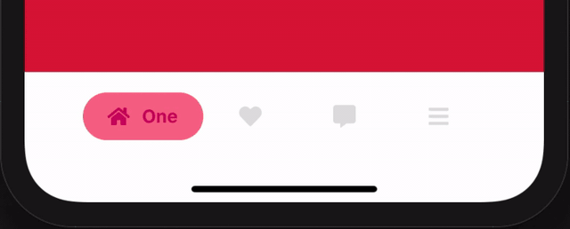

<h1 align="center">
  🧼 react-native-bubble-tabbar
</h1>
<p align="center">
  
  <br />
  <a href="https://www.npmjs.org/package/react-native-bubble-tabbar">
    
  </a>
  <a href="https://www.npmjs.org/package/react-native-bubble-tabbar">
    
  </a>
  <a href="https://www.npmjs.org/package/react-native-bubble-tabbar">
    
  </a>
  <a href="./LICENSE">
    
  </a>
  <br />
  <a href="https://nodei.co/npm/react-native-bubble-tabbar/">
    
  </a>
</p>

> Bubble Tab Bar Component for React Native which supports React Navigation V5 and TypeScript

## 🚀 Action



## 📦 Installation

```bash
npm install react react-native styled-components
# Or using yarn
yarn add react react-native styled-components
```

First, you should install peerdependencies as the command above. You might already installed react and react-native. If you're using TypeScript, it is recommended to install the typings for the each package, too.

```bash
npm install react-native-bubble-tabbar
# Or using yarn
yarn add react-native-bubble-tabbar
```

Finally, install this module and you're ready to go! 🎉

## 🐋 Usage

```tsx
import {
  faHome,
  faHeart,
  faCommentAlt,
  faBars,
} from '@fortawesome/free-solid-svg-icons';
import { FontAwesomeIcon } from '@fortawesome/react-native-fontawesome';
import { BottomTabBarProps } from '@react-navigation/bottom-tabs';
import React from 'react';
import BubbleTabBar, {
  IBubbleTabConfig,
  IIconRenderer,
} from 'react-native-bubble-tabbar';

const tabs: IBubbleTabConfig[] = [
  {
    activeColor: '#cc0066',
    activeBackgroundColor: '#f76a8c',
    activeIcon: faHome,
  },
  {
    activeColor: '#ff6f5e',
    activeBackgroundColor: '#f8dc88',
    activeIcon: faHeart,
  },
  {
    activeColor: '#1eb2a6',
    activeBackgroundColor: '#ccf0e1',
    activeIcon: faCommentAlt,
  },
  {
    activeColor: '#4d80e4',
    activeBackgroundColor: '#9aceff',
    activeIcon: faBars,
    name: 'Last',
  },
];

const fontAwesomeIconRenderer = ({ icon, color }: IIconRenderer) =>
  <FontAwesomeIcon
    icon={icon}
    color={color}
    size={18}
  />;

const CustomTabBar: React.FC<BottomTabBarProps> = ({
  state, descriptors, navigation,
}) => {
  return (
    <BubbleTabBar
      state={state}
      descriptors={descriptors}
      navigation={navigation}
      tabs={tabs}
      iconRenderer={fontAwesomeIconRenderer}
    />
  );
};

const Tab = createBottomTabNavigator();

const MainNavigator: React.FC = () => {
  return (
    <Tab.Navigator
      tabBar={({ state, descriptors, navigation }) =>
        <CustomTabBar
          state={state}
          descriptors={descriptors}
          navigation={navigation}
        />
      }
    >
      <Tab.Screen name="One" component={ScreenOne} />
      <Tab.Screen name="Two" component={ScreenTwo} />
      <Tab.Screen name="Three" component={ScreenThree} />
      <Tab.Screen name="Four" component={ScreenFour} />
      <Tab.Screen
        name="ThisRouteDoesNotShowBecauseOnlyFourObjectsAreInTabs"
        component={ScreenHiddenFromTabBar}
      />
    </Tab.Navigator>
  );
};
```

## ✔️ tabs Props

### `name`

Override prop **name** on <Tab.Screen /> component

| Type | Required |
| ---- | -------- |
| string | No     |

---

### `activeColor`

Color for active tab text and icon

| Type | Required |
| ---- | -------- |
| string | Yes    |

---

### `activeBackgroundColor`

BackgroundColor for active tab

| Type | Required |
| ---- | -------- |
| string | Yes    |

---

### `inactiveColor`

Color & background color for inactive tab

| Type | Required |
| ---- | -------- |
| string | No    |

---

### `activeIcon`

Icon name for active tab

| Type | Required |
| ---- | -------- |
| string | No     |

---

### `disabledIcon`

Icon name for inactive tab

| Type | Required |
| ---- | -------- |
| string | No    |

---

## ✔️ iconRenderer Props

Function with params

### `icon`

Icon name to pass on Icon Component

---

### `color`

Icon color to pass on Icon Component
